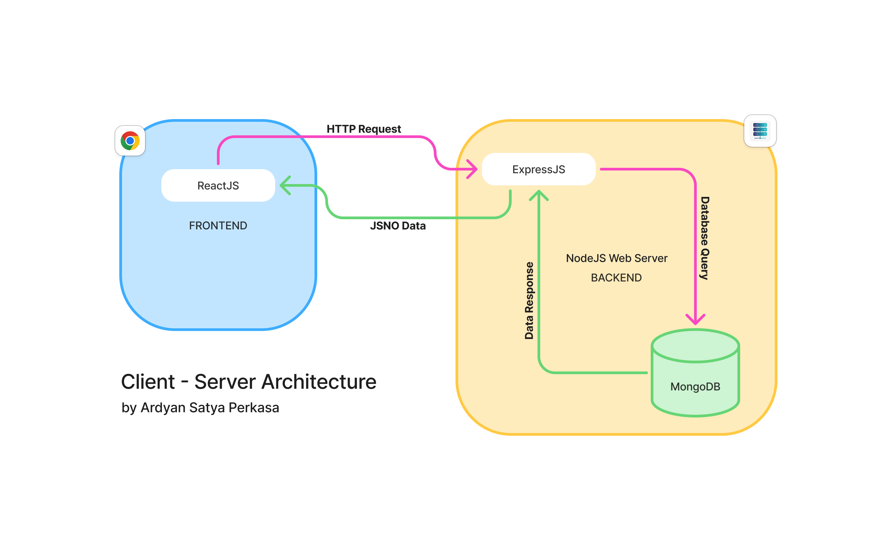

# Labs 1 — Introduction to Full Stack Development & Web Architecture (MERN Overview)

This repository contains my **Labs 1 assignment** from the **LastMiles 2026 Program by Smartbridge**, in the **Fullstack Development (MERN Stack) learning path**.

The purpose of this lab is to understand the **basic structure of a fullstack project** and the **client–server architecture** used in modern web applications, particularly using the **MERN stack**.

---

## Program Information

- **Program:** LastMiles 2026  
- **Provider:** Smartbridge  
- **Learning Path:** Fullstack Development (MERN)  
- **Student:** Ardyan Satya Perkasa  
- **Lab Title:** Introduction to Full Stack Development & Web Architecture (MERN Overview)

---

## Learning Objectives

Through this lab, I learned:

- The basic concept of **Fullstack Development**
- How **Frontend and Backend** are structured in a fullstack project
- The **Client–Server Architecture**
- Overview of the **MERN Stack**:
  - MongoDB (Database)
  - Express.js (Backend Framework)
  - React.js (Frontend Library)
  - Node.js (Runtime Environment)

---

## Task 1 — Fullstack Project Folder Structure

This task demonstrates a **basic fullstack project structure** separating frontend and backend components.

```
fullstack-intro
├── frontend
└── backend
```

Explanation:

- **frontend** → Contains the user interface application (React)
- **backend** → Contains server logic, API, and database integration (Node.js + Express)

This separation helps maintain **clean architecture and scalability** in fullstack development.

---

## Task 2 — MERN Client–Server Architecture Diagram

This task illustrates the **communication flow between components in the MERN stack**.

The architecture consists of:

1. **Frontend (React)**  
   Handles the user interface and sends HTTP requests.

2. **Backend (Node.js + Express)**  
   Processes requests, handles business logic, and communicates with the database.

3. **Database (MongoDB)**  
   Stores and retrieves application data.

### Communication Flow

```
Client (React)
      │
      │ HTTP Request (API)
      ▼
Server (Node.js + Express)
      │
      │ Database Query
      ▼
MongoDB
      │
      │ Data Response
      ▼
Server
      │
      │ JSON Response
      ▼
Client (React)
```

---

## MERN Architecture Diagram



---

## Repository Structure

```
labs-1
│
├── fullstack-intro
│   ├── frontend
│   └── backend
│
└── mern-architecture-diagram.png
```

---

## Notes

This repository is part of my learning journey in **Fullstack Web Development using the MERN stack**.  
Future labs will involve building actual applications using these technologies.

---

## Author

**Ardyan Satya Perkasa**  
LastMiles 2026 — Fullstack Development (MERN)  
by Smartbridge